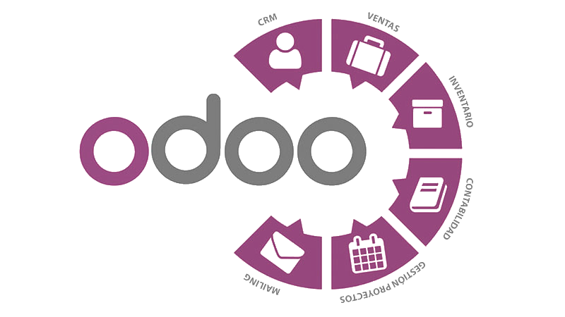

# Trabajo de investigación sobre Odoo

## Índice
- [¿Qué es Odoo?](#index01)
- [Historia resumida de Odoo](#index02)
- [Módulo de operaciones](#index03)
- [Módulo de ventas](#index04)
- [Módulos de sitio web](#index05)

## ¿Qué es Odoo? 

Odoo se trata de un paquete de aplicaciones de código abierto de especial utilidad para empresas. Cubre todas las necesidades que pueden tener: CRM, comercio electrónico, contabilidad, inventario,
punto de venta, gestión de proyectos...

## Historia resumida de Odoo 

En 2005 Odoo empezó con el nombre de TinyERP, con origen en Bélgica. Fue desarrollado en Python y PostgreSQL. Más adelante, en 2008 tuvo un cambio de nombre a OpenERP, con mejor interfaz y potencia, además de tener nuevos módulos. Finalmente en 2014 se quedaron con el nombre de Odoo, mejorando todo en general y añadiendo, además, una versión gratuita (la community edition).

## Módulo de operaciones 

Entre los módulos de operaciones se encuentran:
- Módulo de inventario: Es tanto aplicación de inventario como sistema de gestión de almacén, e incluye una aplicación muy avanzada de lector de código de barras.
- Módulo de recursos humanos: Este módulo ayuda con todo lo relacionado a recursos humanos, es decir, la gestión del personal de la empresa.
- Módulo de compra: Ayuda a llevar un seguimiento de los acuerdos de compra y cotizaciones. Automatiza el proceso de reabastecimiento.
- Módulo de contabilidad: Tiene desarrolladas diversas funciones, como el reconocimiento de facturas por inteligencia artificial o la sincronización con cuentas bancarias.

Existen otros módulos de operaciones, como el de fabricación o el de proyectos.

## Módulo de ventas 

El módulo de ventas contiene:
- Módulo de CRM: Permite el seguimiento de posibles clientes, la comunicación con ellos y la realización de informes.
- Módulo de facturación: Gestiona contratos, crea facturas recurrentes y realiza varias operaciones relacionadas con la facturación de ventas. Puede también realizar informes relacionados a la facturación.

Otros módulos existentes son los de puntos de venta (tienda, restaurante...), firma digital y alquiler.

## Módulo de sitio web 

Finalmente, de cara a los módulos de sitio web, existen:
- Módulo de creación de sitio web: Como su nombre indica, permite la creación de páginas web. Tiene funciones de comercio electrónico, entre otros.
- Módulo de chat en vivo: Permite chatear con clientes en directo. Esto está integrado directamente en la página web. Se pueden crear equipos de soporte y programar respuestas automáticas.

